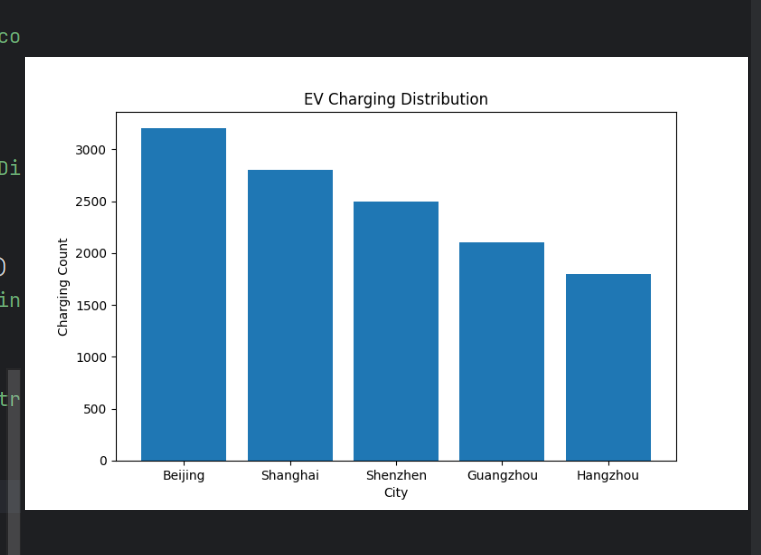
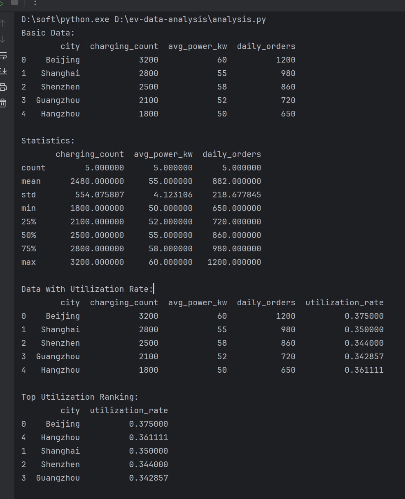

# ev-data-analysis
New energy vehicle charging data analysis using Python and Pandas
## Data Analysis Features

- Data cleaning with Pandas
- Statistical analysis using describe()
- Utilization rate calculation
- City ranking analysis
- Data visualization using Matplotlib

Sample output:

